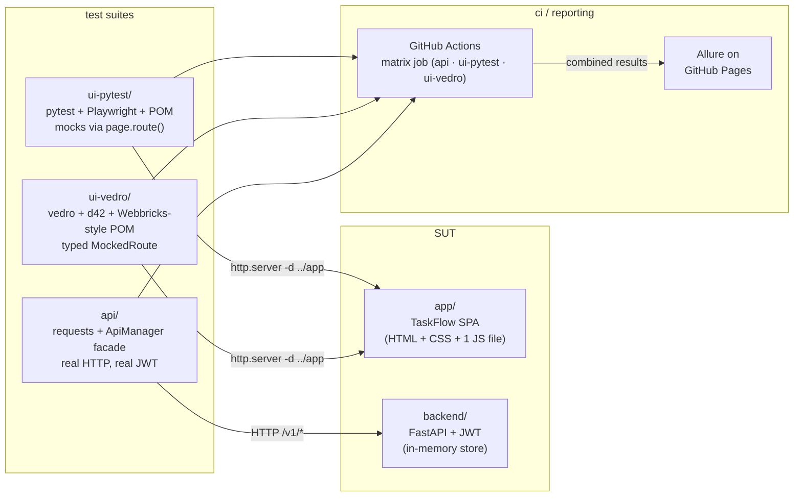
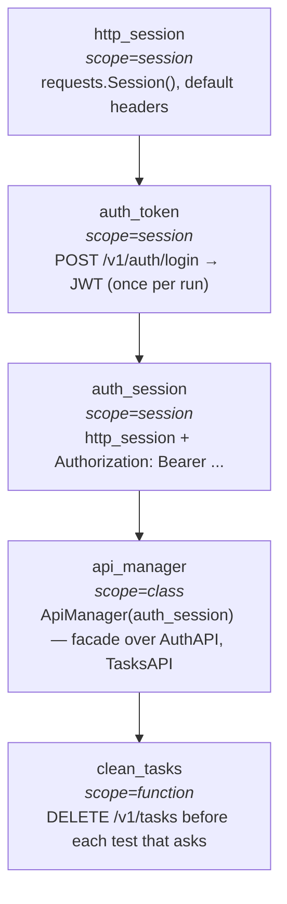

<div align="center">


# qa-automation-portfolio

The same SPA. Three test architectures. One Allure dashboard.

[](https://github.com/alexshabunin/qa-automation-portfolio/actions/workflows/ci.yml)
&nbsp;
[](https://alexshabunin.github.io/qa-automation-portfolio/report/)
&nbsp;
[](LICENSE)

<br/>

[**Landing**](https://alexshabunin.github.io/qa-automation-portfolio/) · [**Live Allure**](https://alexshabunin.github.io/qa-automation-portfolio/report/) · [Tradeoffs](#tradeoffs)

<br/>


</div>

<br/>

The interesting part of this repo isn't the SPA. It's that the three
suites around it differ where it matters and agree where it should.
A `pytest` + Playwright + POM suite for the 80% of teams. A `vedro` +
`d42` + Webbricks-style suite for the 20% that grow into a thousand
tests. A REST API suite hitting a real FastAPI service with real JWT.

## quick look

Open the [live Allure report](https://alexshabunin.github.io/qa-automation-portfolio/report/),
then the [side-by-side example](#same-test-two-stacks), then the
[tradeoffs](#tradeoffs) table.

## the five files I'd point at

1. [`ui-vedro/mocks/mocked_route.py`](ui-vedro/mocks/mocked_route.py) — typed `MockedRoute` with `.history` and a count check on `__aexit__`.
2. [`ui-vedro/schemas/__init__.py`](ui-vedro/schemas/__init__.py) — every constraint cites its source.
3. [`api/conftest.py`](api/conftest.py) — fixture chain, scopes annotated.
4. [`api/custom_requester/custom_requester.py`](api/custom_requester/custom_requester.py) — base class for every API client.
5. [`TESTING.md`](TESTING.md) — the rules; [`docs/adr/`](docs/adr/) argues each one.

## numbers

|                  | api                                | ui-pytest                  | ui-vedro                              |
|------------------|------------------------------------|----------------------------|---------------------------------------|
| tests / scenarios | **25**                            | **11**                     | **7 (one ×3)**                        |
| runtime           | ~3s                                | ~12s                       | ~5s                                   |
| stack             | pytest + requests + ApiManager     | pytest + Playwright + POM  | vedro + Playwright + d42              |
| isolation         | wipe store per test                | mocks via `page.route()`   | typed `MockedRoute` w/ strict counts  |

**43 tests, ~17s wall time on the CI matrix, 0 flakes since the suite went green.** Hermetic — no external endpoints, no staging DB to wait on.

<a href="https://alexshabunin.github.io/qa-automation-portfolio/report/">
  
</a>

<sub>vedro scenarios go through <a href="ui-vedro/scripts/emit_allure_results.py">a small adapter</a> that walks the scenario files, pulls <code>@allure_labels</code> metadata, and emits the per-scenario JSON Allure expects. Runs only after a green vedro pass so the dashboard never claims green it didn't earn.</sub>

## same test, two stacks

The strongest piece of evidence in the repo: the same assertion — *the
SPA's 300 ms debounce coalesces 5 keystrokes into one backend call* —
written in both styles.

<table>
<tr>
<th width="50%">ui-pytest <sub>(classic POM, pytest)</sub></th>
<th width="50%">ui-vedro <sub>(BDD steps, typed mock-server)</sub></th>
</tr>
<tr>
<td valign="top">

```python
class TestSearch:

    @pytest.mark.smoke
    def test_debounce(self, board):
        matching = fake_task(title="Alpha launch retrospective")
        mock = mock_tasks_list(
            board.page, {"data": [matching], "total": 1}
        )

        board.open()
        board.wait_until_ready()
        mock.requests.clear()

        board.search("alpha", delay_ms=30)
        board.page.wait_for_timeout(600)

        assert len(mock.requests) == 1
        assert mock.requests[0].query == {"q": "alpha"}
```

</td>
<td valign="top">

```python
@allure_labels(
    Feature.Search, Story.Search,
    Priority.Critical, AllureID("B-301"),
)
class Scenario(vedro.Scenario):
    subject = "Search input debounces keystrokes..."

    async def given_matching_task(self):
        self.matching_id = fake(ValidIDSchema)
        self.search_response = {"data": [fake(
            TaskSchema % {"id": self.matching_id,
                          "title": "Alpha launch retrospective"})],
            "total": 1}

    async def when_user_types(self):
        async with mocked_tasks_list(
            self.page, self.search_response,
            wait_for_requests=None,
        ) as self.mock:
            await self.board.header.search_input.type(
                "alpha", delay_ms=40)
            await self.board.task_list.get_list_task_by_id(
                self.matching_id).wait_for()

    async def then_exactly_one_call(self):
        assert len(self.mock.history) == 1
```

</td>
</tr>
</table>

Same product, same assertion, different shape. Pick what your team will
actually maintain.

## tradeoffs

|                    | ui-pytest                                  | ui-vedro                                              |
|--------------------|--------------------------------------------|-------------------------------------------------------|
| Best fit           | <300 tests, 1–3 QA                          | 1000+ tests, 5+ QA <sup>[†](#why-1000)</sup>           |
| Onboarding         | hours                                       | days, with payback at scale                            |
| Locators           | `data-test` first, CSS if no other handle    | `data-test` only — CSS/xpath forbidden                |
| Mocks              | per-test `page.route()` helpers              | typed `MockedRoute` + `.history` + strict count       |
| Gives up           | scales painfully past ~300 tests             | every test takes longer to write; new hires need a week |

→ [ADR-001](docs/adr/0001-locators-data-test-only.md) · [ADR-002](docs/adr/0002-mock-count-on-exit.md) · [ADR-003](docs/adr/0003-schemas-cite-source.md) · [ADR-004](docs/adr/0004-typed-allure-labels.md) · [ADR-005](docs/adr/0005-fixture-scopes-picked.md) · [ADR-006](docs/adr/0006-no-retry-on-failure.md)

<a id="why-1000"></a>
**Why 1000+ as the line.** At Lamoda the vedro suite passed 800
scenarios near the moment when "drift-by-string" pain became
material — typo'd `Feature("Bord")` strings split the dashboard, ad-hoc
mock helpers diverged in copy/paste, schema bounds no longer matched
the form. That's when the typed catalog and the strict count check
*earn* their write-once cost. Below ~300, the same patterns cost more
than they save. The middle band is a judgment call — depends on team
churn rate, contract stability of the SUT, how often the team reads
each other's tests. The number is a tendency, not a threshold.

## architecture



## api fixture chain



`auth_token` is session-scope because POST /login is ~200 ms; 100 tests
at function-scope would burn 20 seconds doing nothing useful.
`clean_tasks` is per-function because state isolation between tests is
non-negotiable. → [ADR-005](docs/adr/0005-fixture-scopes-picked.md).

---

<details>
<summary><b>What a failed mock-count assertion looks like</b></summary>

The count check itself, ~12 lines from `ui-vedro/mocks/mocked_route.py`:

```python
async def __aexit__(self, exc_type, exc, tb) -> None:
    await self._page.unroute("**/*", self._handle)
    if exc_type is not None or self._wait_for_requests is None:
        return
    actual = len(self._history)
    if actual != self._wait_for_requests:
        raise AssertionError(
            f"Mock expected {self._wait_for_requests} {self._method} call(s), "
            f"got {actual}. Recorded URLs: {[r.url for r in self._history]}"
        )
```

If the debounce broke on a feature branch:

```
AssertionError: Mock expected 1 GET call(s), got 3.
Recorded URLs: ['…/api/tasks?q=a', '…/api/tasks?q=alp', '…/api/tasks?q=alpha']
```

</details>

<details>
<summary><b>Deliberately not included</b></summary>

**No retry-on-failure decorator.** A flaky test is a test asserting on
the wrong thing. The fix lives in the assertion, not in the runner. The
position is also enforceable — [**pytest-no-retry**](https://github.com/alexshabunin/pytest-no-retry)
aborts the session if `--reruns` or `@flaky(reruns=N)` is used. See [ADR-006](docs/adr/0006-no-retry-on-failure.md).

**No BDD Gherkin layer.** vedro's scenario class is already a readable
DSL — adding Cucumber would be two DSLs solving one problem.

**No `time.sleep`** — anywhere. Contexts wait for the thing the next
step needs, not for a clock.

</details>

<details>
<summary><b>Running locally</b></summary>

```bash
python -m venv .venv && source .venv/bin/activate
pip install -r backend/requirements.txt \
            -r api/requirements.txt \
            -r ui-pytest/requirements.txt
pip install -e ui-vedro
playwright install chromium

( cd backend && uvicorn main:app --port 8000 ) &

cd api        && pytest -v
cd ui-pytest  && pytest -v
cd ui-vedro   && make test
```

</details>

---

<div align="center"><sub>

[alexshabunin.com](https://alexshabunin.com) · [@waytoalex](https://t.me/waytoalex) · shanaleks0007@gmail.com · MIT

</sub></div>
