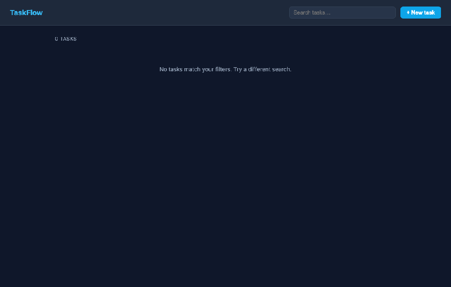
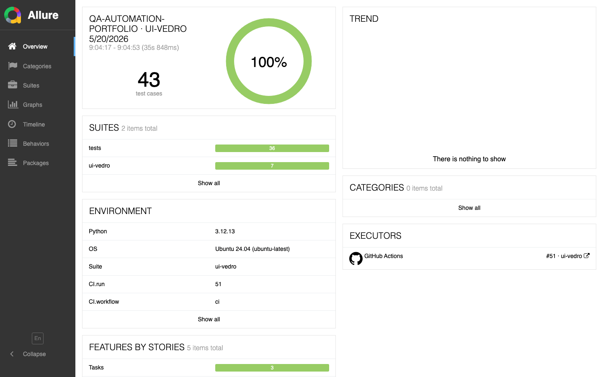
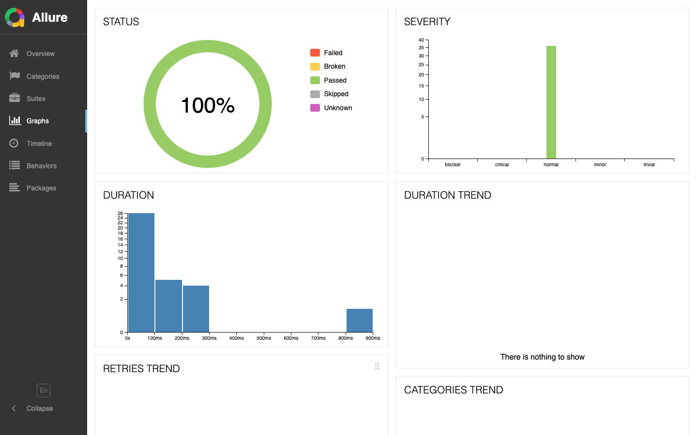
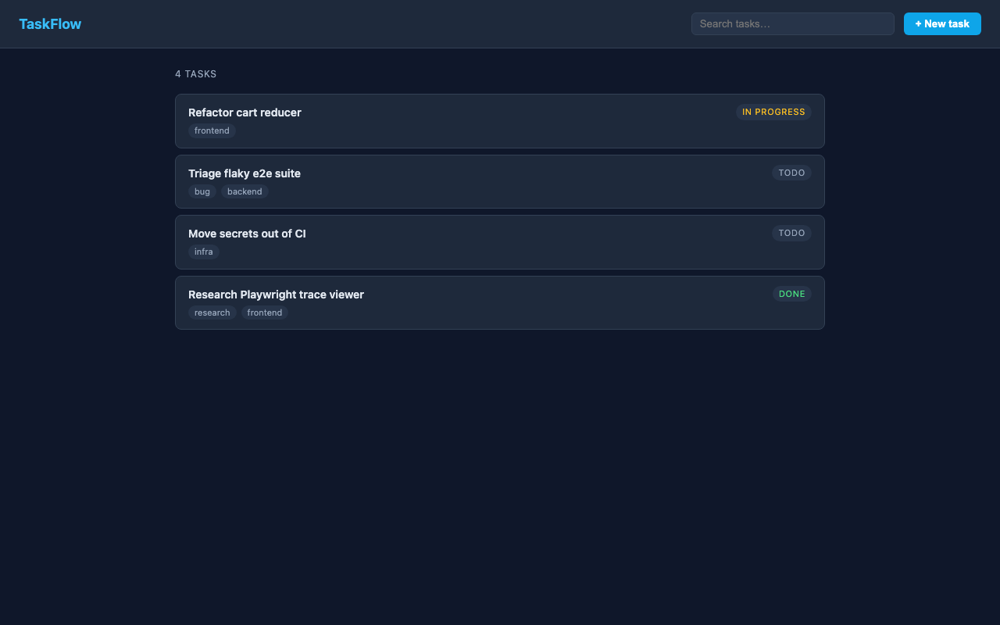
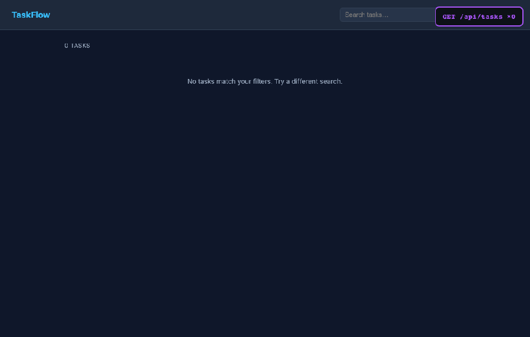
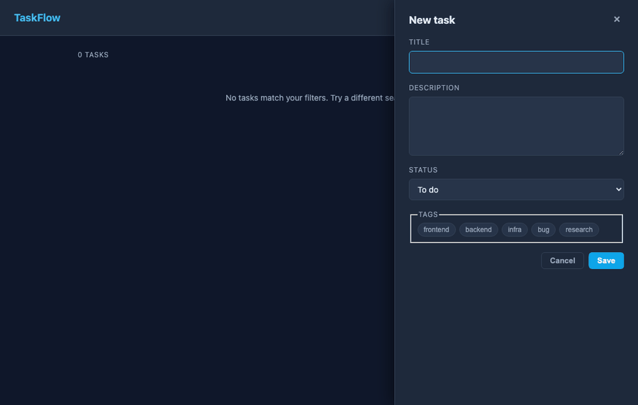
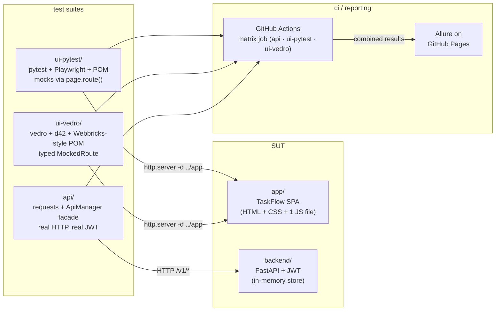
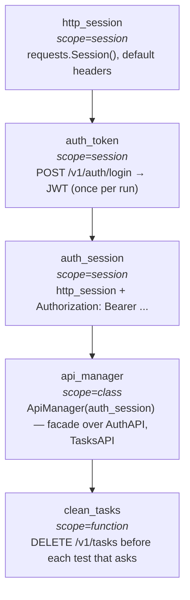

<div align="center">

# qa-automation-portfolio

The same SPA. Three test architectures. One Allure dashboard.

[](https://github.com/nightmarovvv/qa-automation-portfolio/actions/workflows/ci.yml)
&nbsp;
[](#numbers)
&nbsp;
[](https://nightmarovvv.github.io/qa-automation-portfolio/report/)
&nbsp;
[](LICENSE)

<br/>

[**Landing**](https://nightmarovvv.github.io/qa-automation-portfolio/)  ·  [**Live Allure report**](https://nightmarovvv.github.io/qa-automation-portfolio/report/)  ·  [Hiring lead](#for-the-hiring-lead)  ·  [Fellow QA](#for-the-fellow-qa)  ·  [Tradeoffs](#tradeoffs)

</div>

---

<div align="center">

</div>

The interesting part of this repo isn't the SPA — it's how the three
suites around it differ where it matters and agree where it should.
A `pytest` + Playwright + POM suite for the 80% of teams. A `vedro` +
`d42` + Webbricks-style suite for the 20% that grow into a thousand
tests. And a REST API suite hitting a real FastAPI service with real
JWT — same pattern Alex worked with at Lamoda.

---

## for the hiring lead

If you're deciding whether to schedule the next interview, three
artifacts answer most questions:

1. The [**live Allure report**](https://nightmarovvv.github.io/qa-automation-portfolio/report/) — 36 cases, 100% pass,
   reporting wired through CI on every push to `main`.
2. The [**same test, two stacks**](#same-test-two-stacks) side-by-side
   below — the same assertion written against the same SPA in pytest
   and in vedro, so you can read the texture difference directly.
3. The [**tradeoffs**](#tradeoffs) table — when each stack earns its
   weight, where it overspends. That's the senior conversation.

Email and Telegram in the footer.

## for the fellow QA

Five files, ~250 lines total, in this order:

1. `ui-vedro/mocks/mocked_route.py` — typed `MockedRoute` with `.history` and a strict count check on `__aexit__`.
2. `ui-vedro/schemas/__init__.py` — every constraint cites where the bound came from (HTML attr, regex, API).
3. `api/conftest.py` — the fixture chain with scope decisions annotated inline.
4. `api/custom_requester/custom_requester.py` — base class that turns every request into an Allure step with body attached.
5. [`TESTING.md`](TESTING.md) — the 10 explicit rules everything else follows.

---

## numbers

|                  | api                                        | ui-pytest                                | ui-vedro                                          |
|------------------|--------------------------------------------|------------------------------------------|---------------------------------------------------|
| tests / scenarios | **25**                                    | **11**                                   | **7 (one ×3)**                                    |
| runtime           | ~3s                                        | ~12s                                     | ~5s                                              |
| stack             | pytest + requests + ApiManager             | pytest + Playwright + POM                | vedro + Playwright + d42                          |
| isolation         | wipe store per test                        | mocks via `page.route()`                 | typed `MockedRoute` w/ strict counts              |
| auth              | real JWT against `backend/`                | n/a (mocked)                             | n/a (mocked)                                      |

**43 tests, ~17s wall time on the CI matrix, 0 flakes since the suite went green.** Hermetic — no external endpoints, no staging DB to wait on. If green here, green for real.

<a href="https://nightmarovvv.github.io/qa-automation-portfolio/report/">
  
</a>

<sub>Allure shows 36 cases (25 api + 11 ui-pytest). The 7 ui-vedro scenarios run in the same CI matrix; vedro's allure reporter merge into the combined dashboard is the one piece of polish on the TODO.</sub>

<details>
<summary><b>Graphs view — severity, status, duration</b></summary>
<br/>

</details>

---

## the product under test

A small task-management SPA in `app/` — dependency-free vanilla JS,
~200 lines, no build step. The same product is tested three different
ways across this repo.

<div align="center">

</div>

The SPA is intentionally boring. What's interesting is the tests
around it.

---

## a real assertion failing loudly

The SPA wraps `loadTasks` in a 300 ms debounce. The badge in the
corner counts every `GET /api/tasks`. Five keystrokes in 200 ms —
**the counter goes ×0 → ×1**. Anything else and the test fails with
the exact number and URLs it saw.

<div align="center">

</div>

```python
assert len(mock.requests) == 1, (
    f"debounce should coalesce 5 keystrokes into 1 GET, "
    f"got {len(mock.requests)}: {[r.url for r in mock.requests]}"
)
```

<details>
<summary><b>What a mock-discipline failure actually looks like</b></summary>

If the debounce ever broke on a feature branch, the failure would
read:

```
AssertionError: debounce should coalesce 5 keystrokes into 1 GET,
got 3: ['…/api/tasks?q=a', '…/api/tasks?q=alp', '…/api/tasks?q=alpha']
```

That's a diagnosis. "test failed" is not. The cost is one f-string
per assertion; the payback is every future debug session.

More in [TESTING.md §1](TESTING.md) and [ADR-002 — mocks count requests on exit](docs/adr/0002-mock-count-on-exit.md).

</details>

---

## validation that doesn't trust the SUT

The drawer rejects three flavours of bad title client-side — empty,
whitespace-only, too short. The parametrized test runs all three with
their own AllureIDs (`B-401` / `B-402` / `B-403`) so the rows stay
traceable.

<div align="center">

</div>

Every case asserts not just that an error appeared, but that **no POST
was sent** — `create_mock.requests == []`. A client-side reject that
silently fires the request is the worst kind of false-pass.

---

## architecture



---

## same test, two stacks

The single strongest piece of evidence in the repo: the **same**
assertion — "the SPA's 300 ms debounce coalesces 5 keystrokes into one
backend call" — written in both styles.

<table>
<tr>
<th width="50%">ui-pytest <sub>(classic POM, pytest)</sub></th>
<th width="50%">ui-vedro <sub>(BDD steps, typed mock-server)</sub></th>
</tr>
<tr>
<td valign="top">

```python
class TestSearch:

    @pytest.mark.smoke
    def test_debounce_collapses_keystrokes(self, board):
        matching = fake_task(title="Alpha launch retrospective")
        mock = mock_tasks_list(
            board.page, {"data": [matching], "total": 1}
        )

        board.open()
        board.wait_until_ready()
        mock.requests.clear()

        board.search("alpha", delay_ms=30)
        board.page.wait_for_timeout(600)

        assert len(mock.requests) == 1
        assert mock.requests[0].query == {"q": "alpha"}
```

</td>
<td valign="top">

```python
@allure_labels(
    Feature.Search, Story.Search,
    Priority.Critical, AllureID("B-301"),
)
class Scenario(vedro.Scenario):
    subject = "Search input debounces keystrokes..."

    async def given_matching_task(self):
        self.matching_id = fake(ValidIDSchema)
        self.search_response = {
            "data": [fake(TaskSchema % {
                "id": self.matching_id,
                "title": "Alpha launch retrospective",
            })],
            "total": 1,
        }

    async def when_user_types(self):
        async with mocked_tasks_list(
            self.page, self.search_response,
            wait_for_requests=None,
        ) as self.mock:
            await self.board.header.search_input.type(
                "alpha", delay_ms=40
            )
            await self.board.task_list.get_list_task_by_id(
                self.matching_id
            ).wait_for()

    async def then_exactly_one_backend_call(self):
        assert len(self.mock.history) == 1

    async def and_request_carried_the_query(self):
        assert self.mock.history[0].query == {"q": "alpha"}
```

</td>
</tr>
</table>

Same product. Same assertion. Different texture. Pick what your team
will actually maintain.

---

## api/ fixture chain



`auth_token` is `scope="session"` because `POST /login` is ~200 ms —
100 tests at function-scope would burn 20 seconds doing nothing
useful. `clean_tasks` is per-function because state isolation between
tests is non-negotiable. Picking the scope is the engineering
exercise; the conftest is annotated for it. → [ADR-005](docs/adr/0005-fixture-scopes-picked.md).

---

## tradeoffs

|                       | ui-pytest <sub>(pytest + POM)</sub>          | ui-vedro <sub>(vedro + d42)</sub>                       |
|-----------------------|----------------------------------------------|---------------------------------------------------------|
| Best fit              | <300 tests, 1–3 QA                            | 1000+ tests, 5+ QA                                       |
| Onboarding            | hours                                         | days, with payback at scale                              |
| Locators              | `data-test` first, CSS if no other handle      | `data-test` only — CSS/xpath forbidden                  |
| Mocks                 | per-test `page.route()` helpers                | typed `MockedRoute` + `.history` + strict count check    |
| API contracts in UI   | dict literals, `fake_*` helpers                | d42 schemas (`fake(Schema % {...})`) — single source of truth |
| Allure labels         | `@allure.feature/.story` direct                | typed catalog, order enforced by decorator               |
| Iteration speed       | fast                                           | slower per test, more guarantees per test                |
| Reading group         | any pytest user                                | teams already on the vedro stack                         |

Neither is "better." `ui-pytest` is what I'd reach for on a smaller
team. `ui-vedro` earns its weight once contract-shaped pain shows up
in fixtures.

→ [ADR-001 — locators](docs/adr/0001-locators-data-test-only.md) · [ADR-003 — schemas cite source](docs/adr/0003-schemas-cite-source.md) · [ADR-004 — typed allure labels](docs/adr/0004-typed-allure-labels.md)

---

## stack — and why these choices

| Layer            | Tool                          | Why this, not the obvious alternative                                                              |
|------------------|-------------------------------|----------------------------------------------------------------------------------------------------|
| Scenario runner  | **vedro** (Track B)            | async-native, BDD steps without Gherkin, contexts that guarantee state. Cucumber adds a second DSL for the same job. |
| Test runner      | **pytest** (Track A + API)     | universal vocabulary, fixture scoping that matches the actual lifetimes in the suite.              |
| Browser driver   | **Playwright**                 | trace-viewer makes flakes self-debugging; Selenium's launch overhead doesn't earn its keep here.   |
| API contracts    | **d42**                        | typed schemas + `fake()` from the same definition. pydantic doesn't generate values; jsonschema doesn't type-check Python. |
| Mock layer       | **`MockedRoute` over `page.route()`** | mountebank/WireMock would be more infra than this fixture SPA deserves; route() + a wrapper is the right amount. |
| API client       | **`CustomRequester` + `ApiManager`** | facade keeps tests reading like business logic; raw `requests` calls in 80 tests is how you forget to assert status. |
| Reporting        | **Allure**                     | feature/story/severity surfaces what matters; HTML-test-runner is a regression in 2026.            |
| CI               | **GitHub Actions matrix**      | hermetic, one config, free for public repos. Buildkite would be overspend for a portfolio.         |

---

## deliberately not included

What's missing here is on purpose:

- **No Selenium.** Browser-launch overhead doesn't earn its keep below ~1k tests, and Playwright's trace viewer eats Selenium's debugging story.
- **No BDD Gherkin layer.** vedro's scenario class is already a readable DSL — adding Cucumber would be two DSLs solving one problem.
- **No abstract Page Object factory.** Tests instantiate pages directly. The indirection adds a file lookup without removing any line.
- **No retry-on-failure decorator.** A flaky test asserts the wrong thing. The fix lives in the assertion, not in the runner.
- **No screenshot-on-failure heuristic.** Playwright's trace viewer captures more than a PNG ever could.
- **No `time.sleep`.** Anywhere. Contexts wait for the *thing* the next step needs, not a clock. → [TESTING.md §5](TESTING.md).

---

## start where your stack lives

| If your team uses…              | Open                                          |
|---------------------------------|-----------------------------------------------|
| pytest + Playwright + POM       | [**ui-pytest/**](ui-pytest/)                  |
| vedro + d42 + Playwright        | [**ui-vedro/**](ui-vedro/)                    |
| REST API testing                | [**api/**](api/)                              |
| FastAPI fixture backend         | [**backend/**](backend/)                      |
| Architecture decisions          | [**docs/adr/**](docs/adr/)                    |
| Testing philosophy              | [**TESTING.md**](TESTING.md)                  |

---

## running locally

```bash
python -m venv .venv && source .venv/bin/activate
pip install -r backend/requirements.txt \
            -r api/requirements.txt \
            -r ui-pytest/requirements.txt
pip install -e ui-vedro
playwright install chromium

# api suite needs the backend up
( cd backend && uvicorn main:app --port 8000 ) &

cd api        && pytest -v
cd ui-pytest  && pytest -v
cd ui-vedro   && make test
```

The SPA in `app/` is plain static files. UI suites boot `python -m
http.server` against it; the FastAPI in `backend/` is only there for
the API suite.

---

<div align="center">
<sub>

[alexshabunin.com](https://alexshabunin.com)  ·  [@shanaleks](https://t.me/shanaleks)  ·  shanaleks0007@gmail.com  ·  MIT

</sub></div>
