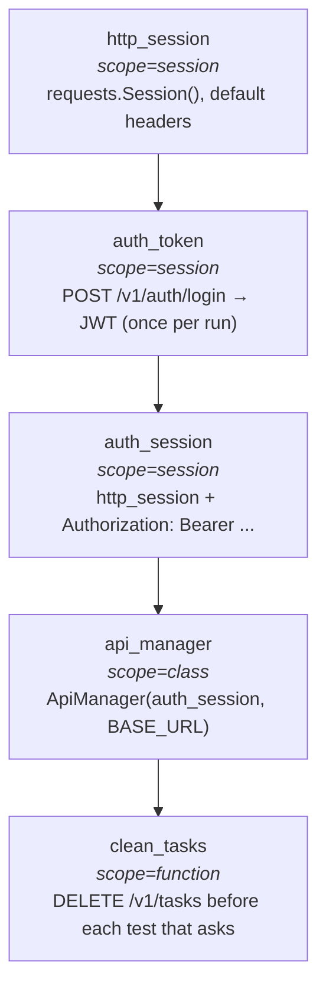

# api

REST API tests for TaskFlow. pytest + requests + allure-pytest.

```bash
pip install -r requirements.txt
pip install -r ../backend/requirements.txt
# start the backend in another shell:
uvicorn --app-dir ../backend main:app --port 8000
# run the suite:
pytest -v
```

25 tests across auth, CRUD, filters, validation. Single hermetic backend,
JWT auth, in-memory store wiped between tests.

## architecture

Same shape Alex worked with at Lamoda. Direct analogue to the UI Page
Object Model:

| UI (POM)             | API (this folder)         |
|----------------------|---------------------------|
| `BasePage`           | `CustomRequester`         |
| `LoginPage(BasePage)`| `AuthAPI(CustomRequester)`|
| `page.click()`       | `send_request(method, url)`|
| `locator`            | `endpoint`                |
| —                    | `ApiManager` (facade)     |

The only thing the UI side doesn't need is a manager: pages are created
inline in tests. API tests *do* need one because the bearer token has to
live on a shared session.

## layout

```
api/
├── custom_requester/
│   └── custom_requester.py    # base — session, base_url, allure attach,
│                                expected_status check
├── apis/
│   ├── auth_api.py            # AuthAPI(CustomRequester)
│   └── tasks_api.py           # TasksAPI(CustomRequester)
├── api_manager.py             # facade: am.auth.*, am.tasks.*
├── conftest.py                # fixtures with session/class/function scopes
└── tests/
    ├── test_auth.py
    ├── test_tasks_crud.py
    ├── test_tasks_filters.py
    └── test_tasks_negatives.py
```

## fixture chain



Picking the scope is the whole game. `auth_token` is `scope="session"`
because POST /login is ~200ms and 100 tests at function-scope means 20
extra seconds of nothing useful. `clean_tasks` is per-function because
state isolation between tests is non-negotiable.

## env vars

| Var                  | Default                  |
|----------------------|--------------------------|
| `API_BASE_URL`       | `http://127.0.0.1:8000`  |
| `DEMO_USER_EMAIL`    | `test@taskflow.io`       |
| `DEMO_USER_PASSWORD` | `Test123!`               |

## what's worth opening

1. `custom_requester/custom_requester.py` — every request logs an allure
   step + attaches request/response bodies. Failures come with the
   payload already in the report.
2. `apis/tasks_api.py` — every endpoint exposes a default `expected_status`
   that negative tests override.
3. `conftest.py:fixture_chain` — read it once and you've seen how the
   whole suite is wired.

## ci

Runs on every push as part of `../.github/workflows/ci.yml`. The
allure-results from this folder are merged with the UI suites into a
single report published to GitHub Pages.
